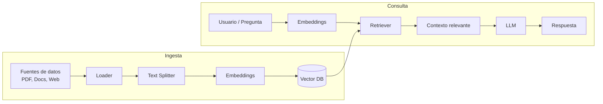

# RAG PDF CLI

CLI para hacer preguntas a documentos PDF utilizando Retrieval-Augmented Generation (RAG) con LangChain y Ollama.

## Diagrama de Arquitectura RAG



Este diagrama muestra el flujo de datos desde la carga del PDF, pasando por el procesamiento y almacenamiento de los embeddings, hasta la generación de respuestas a las preguntas del usuario.

## Entorno virtual

```bash
python -m venv venv
# En Windows
venv\Scripts\activate
# En Unix o MacOS
source venv/bin/activate
```

## Instalar dependencias

```bash
pip install -r requirements.txt
```

## Ejecución

```bash
python main.py ruta/al/documento.pdf
```
